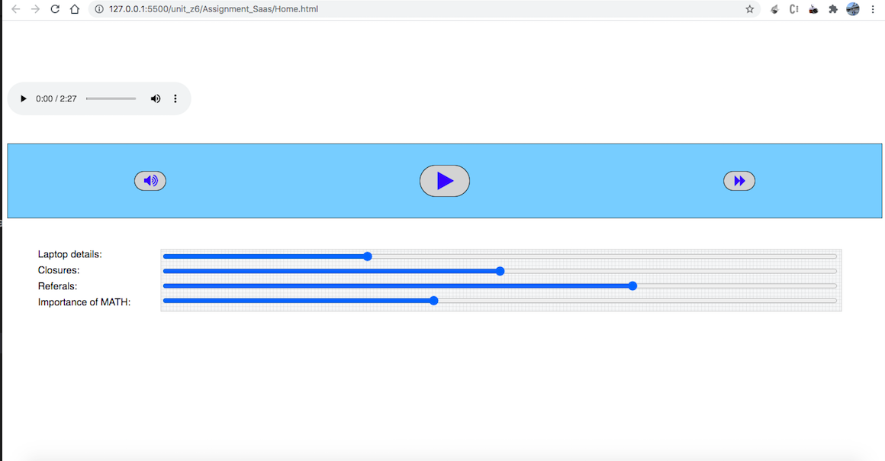
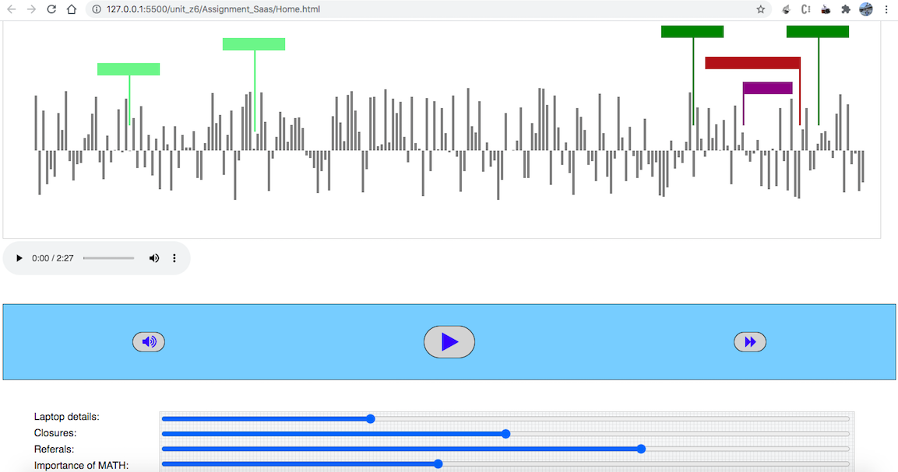
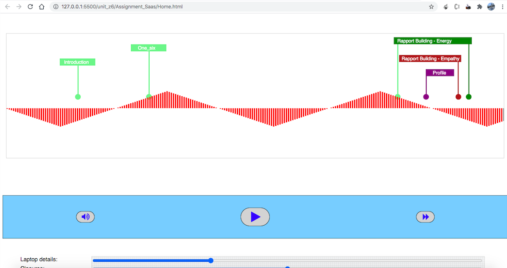
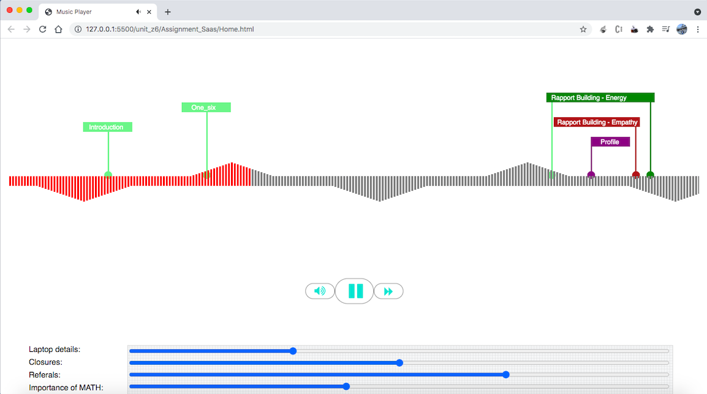

## Problem Statement
- Make a static player with play/pause control (no need of fast forward or audio control)
- The bars height and direction can be random but need to have a maximum height.
- Play Button Click:Audio should play and start moving the audio player.
- Also click anywhere on the player and it should move to the exact time of the audio(like in the video above).
- Add static tags exactly as shown in the above video.
- Pause Button Click : Should stop playing the audio.

## Motto
To learn about html canvas tag and use it for making music player within two days. I learned a lot within these two days and would like to know more about canvas tag as I have understood that its very poweerfull.  

## Demo 
Link- https://drive.google.com/file/d/1I4eQy0BxKa9N52d3zdYSUjdBPsqmNHWq/view?usp=sharing

## Tech Stacks
** JavaScript **
** HTML/Canvas **

## Approach
- Initially i tried to implement a slider over audio tag.
- Once audio slider finished i started working on canvas and tried to fetch the position of mousedown and send it to audio slider.
- After audio slider first i tried to make canvas with multiple layers but later to optimize the app i did the task over one canvas only.
- Later i worked on static bars and tags.
- After this i did Testing for app at multiple steps.

## SnapShots
1. Stag 1

2. Stag 2

3. Stag 3

4. Stag 4

## Conclusion
Got opportunity to learn about canvas tag and i learned a lot within two days of work. Implemented a small music app using canvas tag. 
